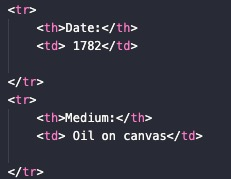
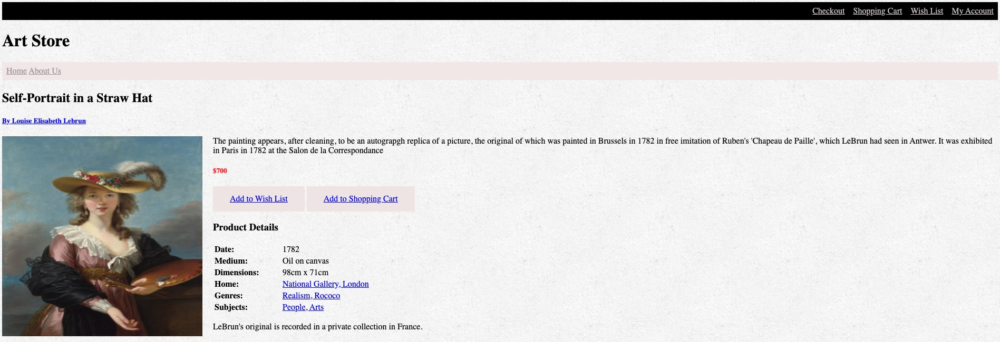
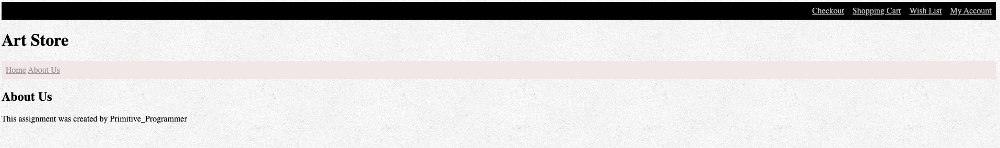

# Coding-With-Friends-Project-1
This project is for the Coding With Friends Discord group. 
# Welcome to the first project of the Coding With Freinds Discord!
## This project is a simple Art Store.
### If you have completed the HTML and CSS sections of free code camp then you are able to do this project.

# What you need to do
1. Download this repository onto your computer. You will not be using the readme_images folder.
2. Open up your preferred text editor. I recommend VS Code.
3. Open all three files: index.html, about.html, style.css
4. You need to set the background to the stucco.png. This will be done in the css file. 
5. There should be two working links. The home and About page.
6. To acheive the Top Navigation. Use a **div class named topnav**.
7. To aceieve the Home and About. Use a **li** inside a **ul**.
8. Everything that you do from there will be in a **section**
9. Use a **table** when you are putting in the product details. 
10. When you are putting in the product details, you must you a **tr** then **th** then **td**

Example of what I mean. This is inside the **table**

    
11. If you Get confused on anything look at the photos down below or ping me on Discord. 

